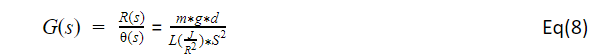

# Ball-N-Plate-Team-1

# 1- INTRODUCTION

  For this project we used a controller to help balance a ball on a plate system that must be designed using Matlab, Simulink and Coppelia. The overall goal of this system is keep   a ball balanced at the center of the plate and must be able to react accordingly to the ball’s position to avoid the ball rolling off the plate. 

# 2- SYSTEM MODELING

In the Figure ( ) is the ball and plate system free body diagram that is being used. To find the nonlinear equation of motion Eq (1) was obtained by using the free body diagram. Also Eq (2) and Eq (3) were found using the geometry in the figure ( ). 

Figure 1. Ball and Plate System

 
 

Table 1: Equations Used
 
 
Using the nonlinear equation of a motion shown in Eq (4) it was then linearized by doing sin(theta) = 0 , which can be written as shown in Eq (5). Next, the transfer function, Eq (7), for one motor was found by taking the Laplace transform of the linearized equation, Eq (6). This transfer function equation will also be used for the second motor as well.
 
 

Table 2: Equations Used Continue
 
 
<header>
  Transfer Function 
 
   a. Transfer function for 1 servo where (s) is the rotation of the motor in rads, and the output is R(s) = ball position.
</header>

# 2- SYSTEM MODELING

# 3- CONTROLLER DESIGN & MODEL SIMULINK

# 4- CONTROLLER IMPLEMENTATION

